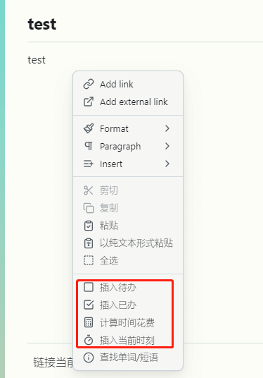

# Obsidian Task Processing Extension Plugin

中文文档 [README](https://github.com/odayou/task-processing-extension/blob/master/README.md)

> An [Obsidian](https://obsidian.md/) plugin for processing tasks, Features：including time statistics, insertion task, and insertion current time.
>
> Developed based on the needs of my own work flow and [the demand of a friend on website](https://forum-zh.obsidian.md/t/topic/30252/4). Any suggestions are welcome.
>
> This is my first time developing a plugin, and I haven't published it to the plugin center yet.

## Repository

[odayou/obsidian-task-processing-extension](https://github.com/odayou/task-processing-extension)

## Features

1. Insert a block that calculates the time spent on tasks (it will search for the pending tasks in the current document) at the cursor position.
2. Insert a pending/completed task at the cursor position.
3. Insert the current time at the cursor position.

## Usage

In the edit view, call the command `time total` to insert a block that calculates the time spent on tasks in the current document. It will list the time spent on each task and the total time spent.

## Demo

- Time statistics of existing tasks

- Quick commands demo

- all the features are integrated into the right-click menu


## Limitations and Notes

- It cannot be automatically calculated in real time, one reason is that I haven't found a way to do it, and the other reason is that I think time statistics is just a temporary solution, and automatic calculation of these may be a transition design or not worth the price.
- I am a beginner in developing plugins, and I know that the commands can only be used in the edit view, and I haven't explored preview mode yet.
- The plugin is still in the early stage of development, and I haven't tested it in a large number of scenarios.
- The current function is to match tasks in the document and calculate the total time spent on them, which means it can only match tasks that start with "- [ ] " or "- [X] " or " - [x] " and calculate the time spent according to the specified format, including the task format/position, time format/position, please refer to the demo or example data, you can modify the matching code to fit your own needs, it's not difficult.
- In the future, if there is spare time, I can redesign the direction as follows: 1. The current function 1 will repeatedly insert the time statistics block, and I will make it possible to replace it automatically. 2. The interaction form may be redesigned, such as as a menu or real-time calculation function. 3. It can calculate the time difference between the start and end time of a task that crosses over a day, and the current default is to calculate the time difference between the same day.
- Note: If you don't modify the code, you must follow the pre-set format to record the time, otherwise the calculation will be incorrect, such as there should be no space between the task name and the time, there should be a space between the task name and the time, and the time format must be "time:minute", etc. I have posted my pending data below, please check the format yourself.
  
## Sample data

```markdown
- [ ] task1 10:21-10:30
    - [ ] task1-1 09:00-10:00  13:00-14:00
    - [ ] task1-2  15:00-16:10  17:00-18:20
- [x] task2 16:10-17:00
    - [ ] tast2-2 10:00-13:00 19:00-20:20
```
